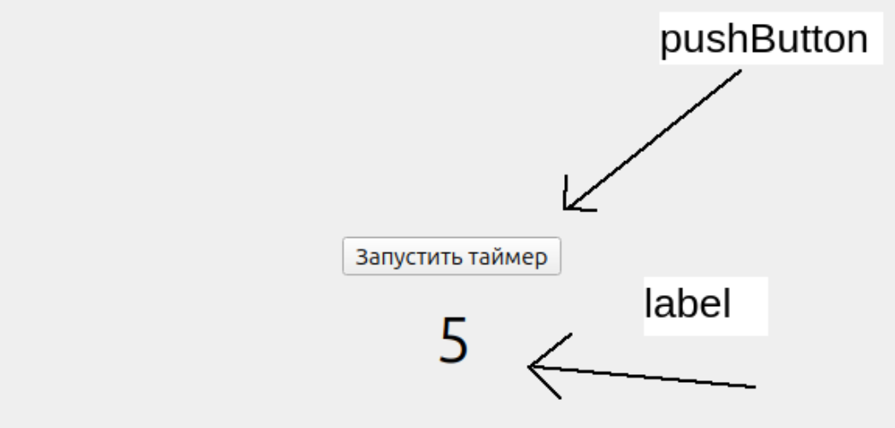

#### Всплывающие окна

- Just a massage
  ```c++
  QMessageBox::about(this, "Заголовок", "Текст внутри");
  ```

* Error window (Like first but whith scarry red christ)

  ```c++
    QMessageBox::critical(this, "Заголовок", "Текст внутри");
  ```

* Warning window(Like first but whith scarry yellow screamer)

  ```c++
    QMessageBox::warning(this, "Заголовок", "Текст внутри");
  ```

* Information window(Like first but with information symbol)

  ```c++
    QMessageBox::information(this, "Заголовок", "Текст внутри");
  ```

* Question window and how to get data from it.

  ```c++
    QMessageBox::StandardButton questionButton = QMessageBox::question(this, "Заголовок", "Текст с вопросом внутри", QMessageBox::Yes | QMessageBox::No);

    if(questionButton == QMessageBox::Yes) {
        qDebug() << "Yes button has been pushed";  /*Just a qt console output. You need to include the <QDebug>*/
    } else {
        qDebug() << "No button has been pushed";  /*qt console output too*/
    }
  ```

#### Переход на другую страницу

В файл .h на странице, с которой будем переходить

```c++
#include "SecondWindow.h"

private:
    Ui::MainWindow *ui;
    SecondWindow *window;
```

Для свершения перехода в файле .cpp на странице, с которой будем переходить

```c++
    window = new InfoWindow(this);
    window->show();
```

Если нам нужно закрыть или скрыть окно

```c++
    this->close();
    this->hide();
```

#### Подключение к sqlite

В файле .pro добавляем sql в этой строчке через пробел

```c++
QT       += core gui sql
```

В файле .h добавляем зависимости

```c++
#include <QSqlDatabase>
#include <QSqlQuery>
#include <QSqlTableModel>
#include <QSqlError>
```

и делаем объект класса QSqlDatabase членом класса основной формы

```c++
private:
    Ui::NoteWindow *ui;
    QSqlDatabase db;
};
```

В файле .cpp

```c++
db = QSqlDatabase::addDatabase("QSQLITE");
db.setDatabaseName("D:/All_projects/qtProjects/userdata.db");

 if (db.open())
    {
        QSqlQuery query = QSqlQuery(db);
        query.exec("SELECT * FROM users");
        while (query.next()) {
            QString lastname = query.value(0).toString(); // В value находиться номер стобца
            qDebug() << lastname;
        }

        ui->statusbar->showMessage("Успешное подключение к бд");
    }
    else
    {
        ui->statusbar->showMessage("Ошибка при подключении к бд: " + db.lastError().databaseText());
    }
```

#### Получение данных по https

```c++
QT       += core gui network
```

```c++
#include <QtNetwork>
#include <QtGui>
#include <QtCore>
```

```c++
 ui->setupUi(this);

    QNetworkAccessManager Manager;

    QUrl APIurl("https://api.country.is/9.9.9.9");

    QNetworkRequest request(APIurl);

    QNetworkReply *reply = Manager.get(request);

    QEventLoop loop;
    QObject::connect(reply, &QNetworkReply::finished, &loop, &QEventLoop::quit);
    loop.exec();

    if(reply->error() == QNetworkReply::NoError)
    {
        qDebug() << "Error : " << reply->errorString();
        QString Response = reply->readAll();
        qDebug() << "API Response : " << Response;
    }
    else
    {
        qDebug() << "Error : " << reply->errorString();
    }
```

#### Сигналы и слоты

Сначала создадим два окна. Добавим на первое(FirstWindow) окно поле **lineEdit** и кнопку **pushButton** и создадим для неё clicked(). На второе(SecondWindow, но здесь это MainWindow потому что мне лень) добавим **label**


В хеадер файле **FirstWindow** добавим signals и добавим туда наш сигнал **signalForSend**, который будет принимать строку(Мы обЪявляем его просто как функцию, он может принемать что угодно. Главное, чтобы слот принемал те-же аргументы).

```c++
#ifndef FIRSTWINDOW_H
#define FIRSTWINDOW_H

#include <QMainWindow>
#include <secondwindow.h>

QT_BEGIN_NAMESPACE
namespace Ui {
class FirstWindow;
}
QT_END_NAMESPACE

class FirstWindow : public QMainWindow
{
    Q_OBJECT

public:
    FirstWindow(QWidget *parent = nullptr);
    ~FirstWindow();

private slots:
    void on_pushButton_clicked();

//Сигналы, которые мы отправляем куда-либо
signals:
    void signalForSend(QString textFromLineEdit);

private:
    Ui::FirstWindow *ui;
    SecondWindow *secondWindow;
};

#endif // FIRSTWINDOW_H
```

Во втором хеадер файле **SecondWindow** создаём слот, который принемает те-же аргументы, что и сигнал.

```c++
#ifndef SECONDWINDOW_H
#define SECONDWINDOW_H

#include <QMainWindow>


namespace Ui {
class SecondWindow;
}

class SecondWindow : public QMainWindow
{
    Q_OBJECT

public:
    explicit SecondWindow(QWidget *parent = nullptr);
    ~SecondWindow();

//Слот, который будет принемать сигнал, после привязки одного к другому
public slots:
    void slotForTake(QString textFromLineEdit);

private:
    Ui::SecondWindow *ui;
};

#endif // SECONDWINDOW_H

```

В классе **SecondWindow** мы создаем реализацию слота, который будет выполнен после отправки сигнала, принемающий аргумент, который будет передан в сигнале

```c++
#include "secondwindow.h"
#include "ui_secondwindow.h"

SecondWindow::SecondWindow(QWidget *parent)
    : QMainWindow(parent)
    , ui(new Ui::SecondWindow)
{
    ui->setupUi(this);
}

SecondWindow::~SecondWindow()
{
    delete ui;
}

//Слот в окне-приемнеке, который будет выполнен после отправки сигнала
void SecondWindow::slotForTake(QString textFromLineEdit)
{
    ui->label->setText(textFromLineEdit);
}
```

Теперь в классе **FirstWindow** привяжем сигнал к слоту при открытии окна и в **on_pushButton_clicked** передадим сигнал с аргументом в слот.

```c++
#include "firstwindow.h"
#include "ui_firstwindow.h"

FirstWindow::FirstWindow(QWidget *parent)
    : QMainWindow(parent)
    , ui(new Ui::FirstWindow)
{
    ui->setupUi(this);
    secondWindow = new SecondWindow;
    secondWindow->show();

    //Здесь происходит привязка сигнала к слоту
    QObject::connect(this, &FirstWindow::signalForSend, secondWindow, &SecondWindow::slotForTake);
}

FirstWindow::~FirstWindow()
{
    delete ui;
}

void FirstWindow::on_pushButton_clicked()
{
    //Здесь происходит сама отправка сигнала, который заставит выполниться слот
    emit signalForSend(ui->lineEdit->text());
}
```

#### Css

**Можно добавить двумя способами**

- **Выбрав 'changeStyleSheat' в дизайнере для самой самого window**
  Для задания стиля для всего типа элементов на странице, указываем назваение страницы

        ```css
        QPushButton {
          background: rgb(0, 0, 0);
        }
        ```

  Для задания стиля конкретного элемента нужно указать object name самого объекта

  ```css
  QPushButton#pushButton {
    background: aqua;
  }
  ```

- **Создав отдельный файл**
  Для этого нажимаем на папку проекта, выбираем **add new**, выбираем **файл ресурсов qt**. Затем, после создания файла, мы нажимаем не него, выбираем пункт **add new** и добавляем пустой файл, указав расширение **.css**. В этом файле мы можем менять стиль для всего проекта, но сначала css нужно подключить в main.cpp.

  ```c++
  #include <QApplication>

  #include <firstwindow.h>
  #include <secondwindow.h>

  #include <QFile>

  int main(int argc, char *argv[])
  {
      QApplication a(argc, argv);

      QFile file(":/style.css");
      file.open(QFile::ReadOnly);
      a.setStyleSheet(file.readAll());

      FirstWindow w;
      w.show();
      return a.exec();
  }

  ```

#### Serial port

В файле **.pro** добавляем зависимость

```c++
QT       += core gui serialport
```

В заголовочном файле

```c++
#include <QSerialPort>
#include <QSerialPortInfo>

...

private:
    Ui::MainWindow *ui;
    QSerialPort *serialPort;
```

В C++ файле
Здесь представлена только запись
```c++
    serialPort = new QSerialPort();
    serialPort->setPortName("COM3");
    serialPort->setBaudRate(QSerialPort::Baud9600);
    serialPort->setParity(QSerialPort::Parity::NoParity);
    serialPort->setDataBits(QSerialPort::DataBits::Data8);
    serialPort->setStopBits(QSerialPort::StopBits::OneStop);
    serialPort->setFlowControl(QSerialPort::FlowControl::NoFlowControl);
    serialPort->open(QIODevice::ReadWrite);

    if(serialPort->isOpen()){
        qDebug() << "Serial port is connected";
        serialPort->write("test"); //put the byte array here
    } else {
        qDebug() << "Serial port is connected";
    }
    serialPort->clear();
    serialPort->close();
```
Чтение обычно выполняется либо в отдельном потоке, либо в бесконечном цикле(но он обычно стопорит весь UI)
Рассмотрим самый простой способ. Через сигнал readyRead. Чтение будем активировть нажатием на кнопку.
```
private slots:
    void on_receivePushButton_clicked();
    void on_serialReceived();
```
```c++
void MainWindow::on_receivePushButton_clicked()
{
    serialPort = new QSerialPort();
    serialPort->setPortName("COM3");
    serialPort->setBaudRate(QSerialPort::Baud9600);
    serialPort->setParity(QSerialPort::Parity::NoParity);
    serialPort->setDataBits(QSerialPort::DataBits::Data8);
    serialPort->setStopBits(QSerialPort::StopBits::OneStop);
    serialPort->setFlowControl(QSerialPort::FlowControl::NoFlowControl);
    serialPort->open(QIODevice::ReadWrite);

    connect(serialPort, SIGNAL(readyRead()), this, SLOT(on_serialReceived()));
    //p.s. serialPort будет очень долго открыт в своём потоке и будет недоступен для остальной системы. Чтобы такого не было, его нужно закрыть через какое-нибудь время.

}

void MainWindow::on_serialReceived()
{
    qDebug() << serialPort->readAll();
    serialPort->clear();
    serialPort->close();
}
```

TODO Сходи на работу и вспомни, как ты заставил это работать

#### QTimer
Что, если нам нужно менять UI раз в определенное время? Напишем для примера калькулятор:
Header
```c++
#include <QTimer>
...
private slots:
    void on_pushButton_clicked();
    void on_updateTimer();
private:
    QTimer timer;
...
```
Source (Window)
```c++
void MainWindow::on_pushButton_clicked()
{
    connect(&timer, SIGNAL(timeout()), this, SLOT(on_updateTimer()));
    timer.setInterval(1000);
    timer.start();
}

int increment;
void MainWindow::on_updateTimer()
{
    increment += 1;
    ui->label->setText(QString::number(increment));
}
```
Как это выглядит:

