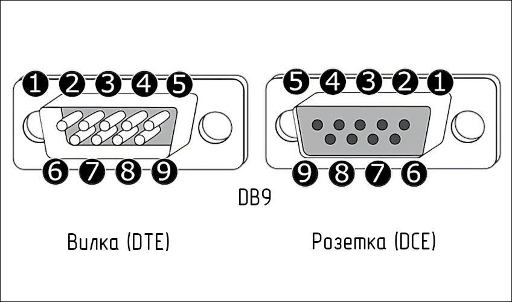
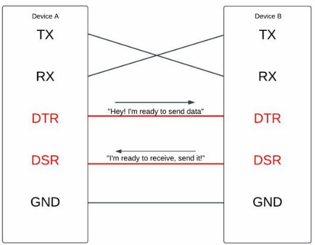
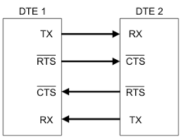

### RS232 DB9

1 - Data carrier detect (Хз, что это)
2 - Чтение данных
3 - Отправка данных
4 - DTR (Data transmit ready)
5 - Signal ground
6 - DSR (Data set ready)
7 - RTS (Request to send)
8 - CTS (Clear to send)
9 - Ring indicator

DTR и RTS нужны для аппаратного контроля приходящих и уходящих пакетов. Их обычно их применяют при непрерывной передаче.

### Контроль ввода вывода по DTR/DSR

### Контроль ввода вывода по RTS/CTS

